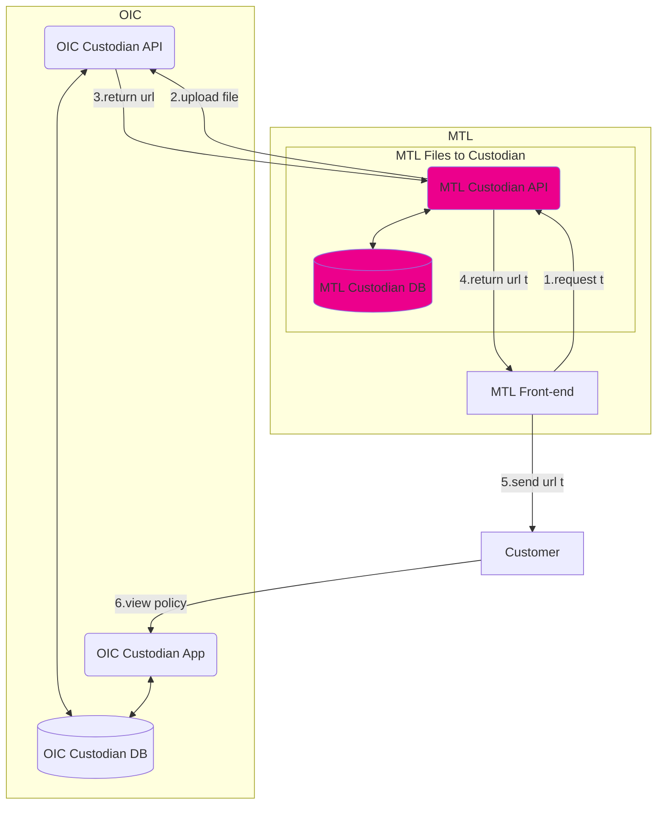
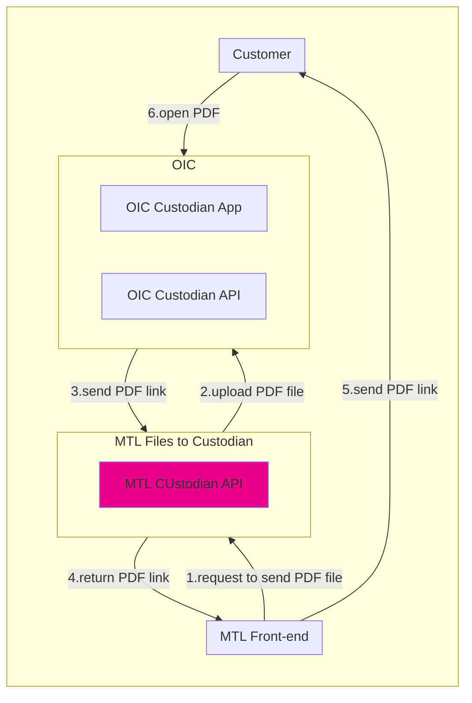
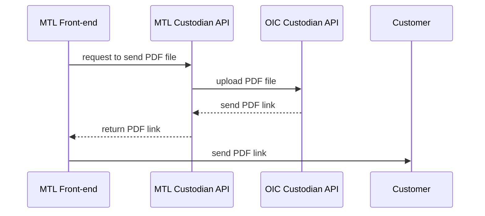

# MTL Files to Custodian

Updated 2026-03-05-T12:55:00

## OIC Custodian

คปภ. ประกาศจะบังคับให้บริษัทประกัน จัดส่งไฟล์ E-Policy (รวมถึงสลักหลัง) ไปจัดเก็บไว้ที่ระบบ Custodian ของ คปภ. ด้วย เพื่อให้ลูกค้าสามารถเข้าถึงไฟล์กรมธรรม์ได้สะดวก โดยกำหนดให้ไฟล์ที่จะส่งไปจัดเก็บควรจะต้อง sign Digital Signature เพื่อความน่าเชื่อถือ ก่อนด้วย

### Documentation
* [Custodian API v1.5](https://drive.google.com/file/d/19yLooCquX9eJ8nObFHrcJLy_W-HuJaEd/view?usp=sharing) (ได้รับจาก คปภ. เมื่อ 04-MAR-26)
* [Custodian FAQ](https://drive.google.com/file/d/1oLDnnisEdgyj-QcFD5pwJ9G5UTOSbpAQ/view?usp=sharing) (ได้รับจาก คปภ. เมื่อ 23-FEB-26)
	* ข้อ 23 คปภ. แนะนำว่า ไฟล์สลักหลัง (ถ้ามี) ให้ส่งไปที่ฟิลด์ "main_file_pdf" ที่เดียวกับไฟล์กรมธรรม์ เพื่อให้เป็น Versioning
* [ระเบียบการรับส่งข้อมูลด้วยวิธีการทางอิเล็กทรอนิกส์ พ.ศ. 2558](https://drive.google.com/file/d/1K1EiUavKdGXl6HtFhiAcRRVNtLvBvpE3/view?usp=sharing) (ได้รับจาก คปภ. เมื่อ 23-FEB-26)
* [หนังสือแสดงความตกลงการใช้บริการรับส่งข้อมูลด้วยวิธีการทางอิเล็กทรอนิกส์ - หนังสือขอใช้ API](https://drive.google.com/file/d/1SNP-II1fpYXufbY5EJIM13qkJmSjsh2m/view?usp=sharing) (ได้รับจาก คปภ. เมื่อ 23-FEB-26)
* [หนังสือแต่งตั้งผู้ปฏิบัติการ (operating officer)](https://drive.google.com/file/d/1EyLqQxDS-1ZOj8tPO1DQCFUQdAJMAX1k/view?usp=sharing) (ได้รับจาก คปภ. เมื่อ 23-FEB-26)
* [Slide ประชุมชี้แจงนโยบายการออกกรมธรรม์ประกันภัยโดยใช้วิธีการทางอิเล็กทรอนิกส์ (E-POLICY)](https://drive.google.com/file/d/14j8jijipcCgY4cl2UX2g4pnjupMZWpry/view?usp=sharing) (ได้รับจากที่ประชุมภายใน จัดโดย Compliance เมื่อ 13-FEB-26)
* [Slide การเตรียมความพร้อมสำหรับการออก e-Policy และการเชื่อมต่อระบบ Custodian (คปภ.)](https://drive.google.com/file/d/19VjI_yL_6GxHR4nYZIppcJcaK5-_KhiD/view?usp=sharing) (ได้รับจากที่ประชุมภายใน จัดโดย Compliance เมื่อ 13-FEB-26)

## MTL ไฟล์กรมธรรม์อิเล็กทรอนิกส์ (E-Policy)

* ปัจจุบัน ไฟล์ PDF E-Policy ถูก generate จากระบบ CentralPro / OpenText
	* สำหรับประกันชีวิตรายเดี่ยว
	* E-Policy มีแผนที่เปลี่ยนไป generate จากระบบ OL Connect แทน (ใน phase 1)
	* ทุกกรมธรรม์ (แต่ยังไม่รวมกรมธรรม์ประเภท ILP)
		* ไม่นับรวม ความคุ้มครองที่ออกในลักษณะใบรับรอง (Certificate)
* ระบบ CentralPro / OpenText _(ITO1)_ และ LOF4NB _(ITM)_ เตรียมไฟล์ PDF E-Policy, ไฟล์ข้อมูล .dat, ไฟล์ข้อมูล .log ไว้ให้ใน folder ที่กำหนด
* ระบบจัดส่ง E-Policy _(ITA)_ นำทั้ง 3 ไฟล์ ไปดำเนินการต่อ
	* นำไฟล์ PDF E-Policy ไป sign Digital Signature พร้อมกำหนดรหัสผ่านเปิดไฟล์ (วดป. เกิด)
	* นำไฟล์ PDF E-Policy ที่ signed แล้ว upload ขึ้น DropBox & Google
	* นำ link URL ที่ได้จาก DropBox มาทำ shorten link
	* จัดส่งไฟล์ PDF E-Policy
		* จัดส่ง e-mail แนบไฟล์ PDF E-Policy ที่ signed แล้ว ให้ลูกค้าที่เลือกรับเป็น E-Policy
		* จัดส่ง SMS แนบ link ให้ลูกค้าทุกคน
  

## MTL ไฟล์สลักหลังอิเล็กทรอนิกส์ (E-Endorsement)

* ปัจจุบัน ไฟล์ PDF E-Endorsement ถูก generate จากระบบ CentralPro
	* สำหรับประกันชีวิตรายเดี่ยว
	* E-Endorsement ยังไม่ได้อยู่ในแผนที่เปลี่ยนไป generate จากระบบ OL Connect แทน (ใน phase 1)
* ระบบ WF4POS _(ITM)_
	* ได้รับไฟล์ PDF E-Endorsement ที่ถูก generate จา่ก CentralPro มาแสดงที่หน้าจอ WF4POS ให้ผู้ใช้งานตรวจสอบความถูกต้อง ถ้าถูกต้อง จะส่งไปให้ CentralPro แปะรูปภาพลายเซ็นต์ของผู้มีอำนาจลงไป
	* ได้รับไฟล์ PDF E-Endorsement ที่แปะรูปภาพลายเซ็นต์ของผู้มีอำนาจแล้ว มาแสดงที่หน้าจอ WF4POS ให้ผู้ใช้งานสั่งพิมพ์ออกเป็น กระดาษ เพื่อนำไปจัดส่งให้ลูกค้า
	* มีเฉพาะไฟล์ PDF E-Endorsement ของกรมธรรม์ประเภท ORD
* ยังไม่มีการนำไฟล์ PDF E-Endorsement ไป sign Digital Signature
* ยังไม่มีการจัดส่งไฟล์ PDF E-Endorsement ไปให้ลูกค้า
* ยังไม่มีการจัดทำไฟล์ PDF E-Endorsement ของกรมธรรม์ประเภท ILP
  

## แนวทางการ Implementation

สำหรับ ไฟล์ PDF E-Policy นั้น ระบบจัดส่ง E-Policy _(ITA)_ จะต้องเป็นคนนำส่งไฟล์ PDF E-Policy ไปให้ที่ระบบ Custodian ของ คปภ. อยู่แล้ว แต่สำหรับไฟล์ PDF E-Endorsement อาจจะพิจารณาแนวทางในการ implement อื่นได้ เช่น

### _(ITA)_ จะ provide MTL Custodian API ไว้ให้ระบบอื่น ที่จัดทำเกี่ยวกับสลักหลัง เป็นคนเรียกใช้ในการส่งไฟล์ให้ คปภ.

_(ITA)_ จะต้อง provide เส้น API (อาจจะตั้งชื่อว่า MTL Custodian API) ให้ระบบอื่นเรียกใช้ POST/PUT/DELETE ไฟล์ที่จะส่งไปให้ระบบ Custodian แทนที่่จะให้ระบบอื่น เรียกใช้ Custodian API ของ คปภ. เองโดยตรง

สำหรับ method PUT ของเส้น MTL Custodian API ในกรณีสลักหลัง รับค่าเลขที่กรมธรรม์, Base64 ของไฟล์ PDF E-Endorsement, ชื่อไฟล์ PDF E-Endorsement ก็พอ

สำหรับ method PUT/DELETE ของเส้น MTL Custodian API ในกรณีสลักหลัง อาจจะไม่จำเป็นต้องเรียกใช้ แต่ _(ITA)_ อาจจะ implement เผื่อไว้สำหรับระบบอื่นในอนาคตที่อาจจะต้องการ

#### Advantages
* Flow การ generate ไฟล์ PDF E-Endorsement จึงถึงการนำส่งไฟล์ไปยังระบบ Custodian เป็นไปอย่างต่อเนื่อง ไม่ต้องเสียเวลา (มี batch กวาดไฟล์จาก folder ไปดำเนินการต่อ), ไม่ต้องเสี่ยงกรณีไฟล์ใน folder ที่กำหนดมาไม่ครบ
* ระบบอื่น ไม่จำเป็นต้องรู้ Custodian API key (มีแค่ _(ITA)_ ที่ทราบ Custodian API key คนเดียว)
	* ระบบอื่น generate ไฟล์ PDF E-Endorsement อยู่แล้ว
	* ระบบอื่น นำไฟล์ PDF E-Endorsement ไป sign Digital Signature เองก่อน
	* ระบบอื่น เรียกใช้เส้น MTL Custodian API เพื่อใช้ในการ POST/PUT/DELETE (กรณีสลักหลัง จะเป็น PUT)
* MTL Custodian API ที่ _(ITA)_ provide ไว้ จะมีการจัดเก็บ log ทำให้เป็นศูนย์กลางที่เดียว ที่จะรู้ได้ว่า กรมธรรม์ 1 ฉบับ มีการจัดส่งไฟล์ไปให้ระบบ Custodian เมื่อไร จากระบบอะไรบ้าง

#### Concerns
* ใช้เวลาในการ implement ทั้งระบบอื่น และ _(ITA)_ ที่จะต้อง provide MTL Custodian API ด้วย

## Flowchart

## Sequence Diagram

